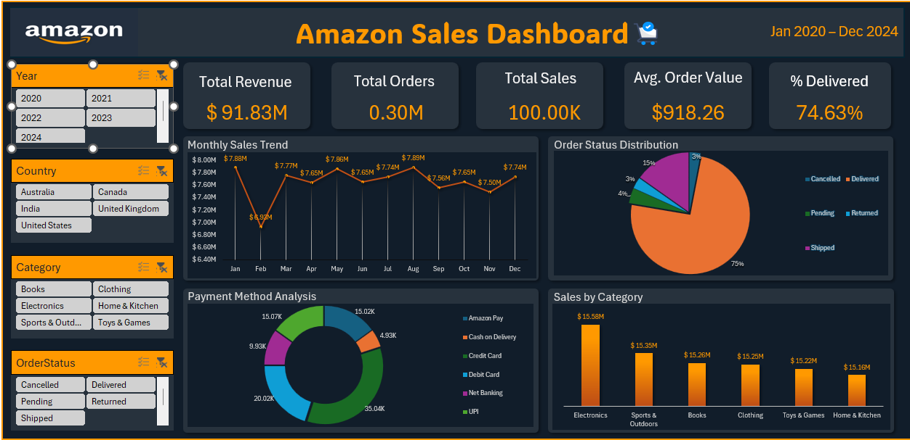

# Amazon-Sales-Dasboard

## Dashboard Preview

---

## Project Overview

The Amazon Sales Dashboard is an interactive Power BI solution designed to monitor sales performance, revenue trends, order fulfillment, and customer purchasing behavior from January 2020 to December 2024. The dashboard provides a centralized view of key business metrics, enabling stakeholders to make data-driven decisions and identify growth opportunities.

## Key Performance Indicators

| KPI | Value |
|------|---------|
| Total Revenue | $91.83M |
| Total Orders | 0.30M |
| Total Sales | 100K |
| Average Order Value | $918.26 |
| Delivered Orders | 74.63% |

## Features

- Interactive filtering by Year, Country, Category, and Order Status
- Monthly Sales Trend Analysis
- Order Status Distribution
- Payment Method Analysis
- Category-wise Sales Performance
- Executive KPI Summary

## Dashboard Insights

- Electronics is the highest revenue-generating category.
- Approximately 75% of orders were successfully delivered.
- Digital payment methods contribute significantly to overall transactions.
- Sales performance remains consistent throughout the analyzed period.

## Tools & Technologies

- Power BI Desktop
- Power Query
- DAX (Data Analysis Expressions)
- Data Modeling
- Data Visualization

## Business Value

This dashboard helps organizations:

- Monitor sales performance in real time
- Evaluate fulfillment efficiency
- Identify top-performing product categories
- Analyze customer payment preferences
- Support strategic and operational decision-making

